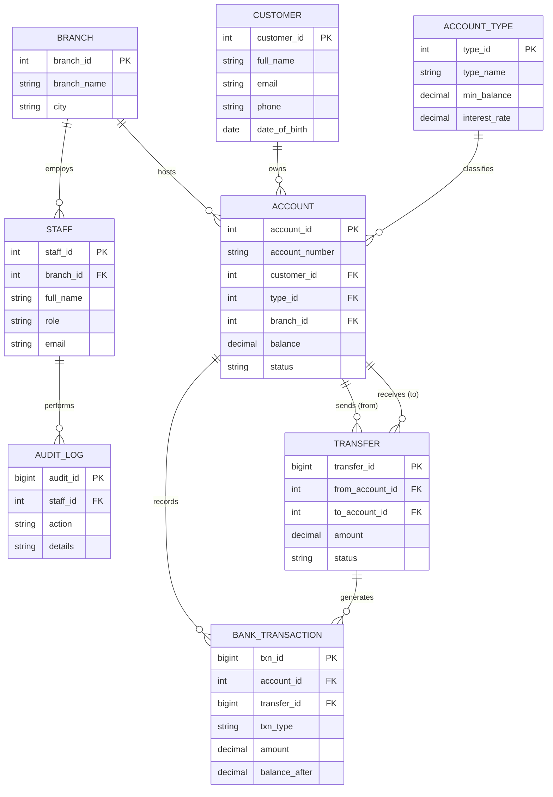

# ER Diagram: Eborka Trust Bank
Student: Marvellous Ewere Eborka | ID: 301922558

```mermaid
erDiagram
    BRANCH ||--o{ STAFF : employs
    BRANCH ||--o{ ACCOUNT : hosts
    CUSTOMER ||--o{ ACCOUNT : owns
    ACCOUNT_TYPE ||--o{ ACCOUNT : classifies
    ACCOUNT ||--o{ BANK_TRANSACTION : records
    ACCOUNT ||--o{ TRANSFER : "sends (from)"
    ACCOUNT ||--o{ TRANSFER : "receives (to)"
    TRANSFER ||--o{ BANK_TRANSACTION : generates
    STAFF ||--o{ AUDIT_LOG : performs

    BRANCH { int branch_id PK
             string branch_name
             string city }
    STAFF { int staff_id PK
            int branch_id FK
            string full_name
            string role
            string email }
    CUSTOMER { int customer_id PK
               string full_name
               string email
               string phone
               date date_of_birth }
    ACCOUNT_TYPE { int type_id PK
                   string type_name
                   decimal min_balance
                   decimal interest_rate }
    ACCOUNT { int account_id PK
              string account_number
              int customer_id FK
              int type_id FK
              int branch_id FK
              decimal balance
              string status }
    TRANSFER { bigint transfer_id PK
               int from_account_id FK
               int to_account_id FK
               decimal amount
               string status }
    BANK_TRANSACTION { bigint txn_id PK
                       int account_id FK
                       bigint transfer_id FK
                       string txn_type
                       decimal amount
                       decimal balance_after }
    AUDIT_LOG { bigint audit_id PK
                int staff_id FK
                string action
                string details }
```
