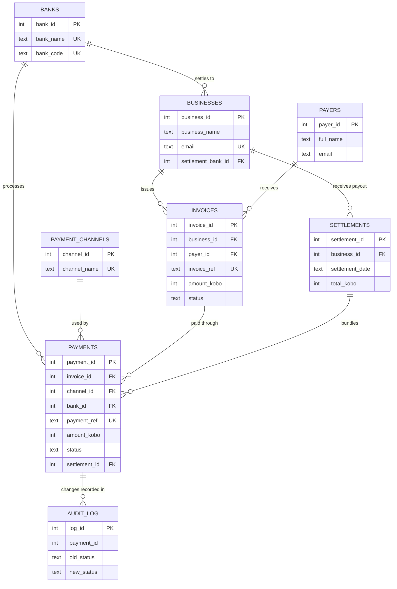

# Crest Tech ER Diagram (Mermaid: GitHub draws it automatically)

```mermaid
erDiagram
    BANKS ||--o{ BUSINESSES : "settles to"
    BANKS ||--o{ PAYMENTS : "processes"
    PAYMENT_CHANNELS ||--o{ PAYMENTS : "used by"
    BUSINESSES ||--o{ INVOICES : issues
    PAYERS ||--o{ INVOICES : receives
    INVOICES ||--o{ PAYMENTS : "paid through"
    BUSINESSES ||--o{ SETTLEMENTS : "receives payout"
    SETTLEMENTS ||--o{ PAYMENTS : bundles
    PAYMENTS ||--o{ AUDIT_LOG : "changes recorded in"

    BANKS { int bank_id PK  text bank_name UK  text bank_code UK }
    PAYMENT_CHANNELS { int channel_id PK  text channel_name UK }
    BUSINESSES { int business_id PK  text business_name  text email UK  int settlement_bank_id FK }
    PAYERS { int payer_id PK  text full_name  text email }
    INVOICES { int invoice_id PK  int business_id FK  int payer_id FK  text invoice_ref UK  int amount_kobo  text status }
    PAYMENTS { int payment_id PK  int invoice_id FK  int channel_id FK  int bank_id FK  text payment_ref UK  int amount_kobo  text status  int settlement_id FK }
    SETTLEMENTS { int settlement_id PK  int business_id FK  text settlement_date  int total_kobo }
    AUDIT_LOG { int log_id PK  int payment_id  text old_status  text new_status }
```
